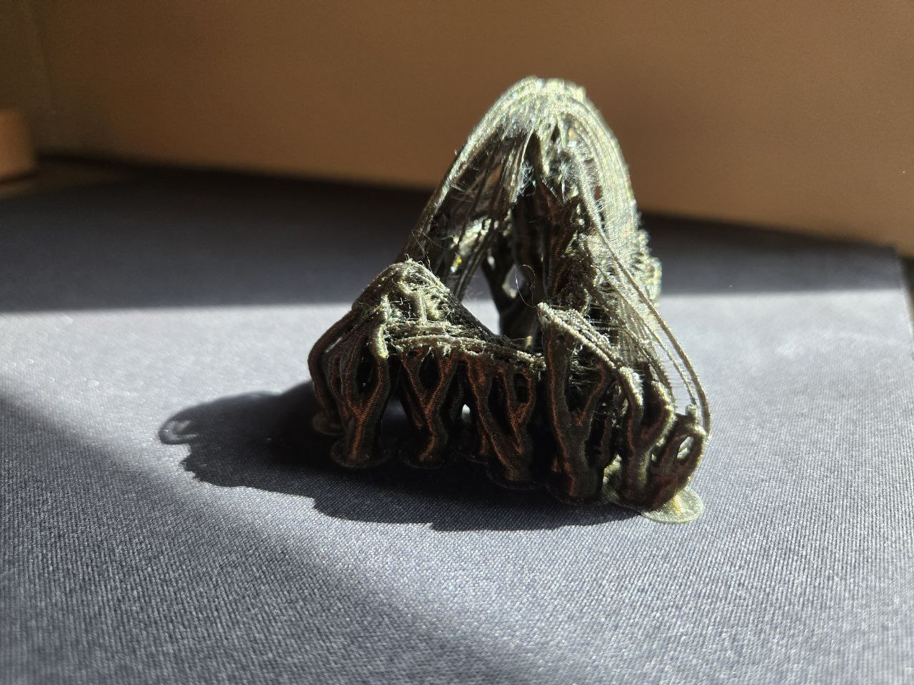
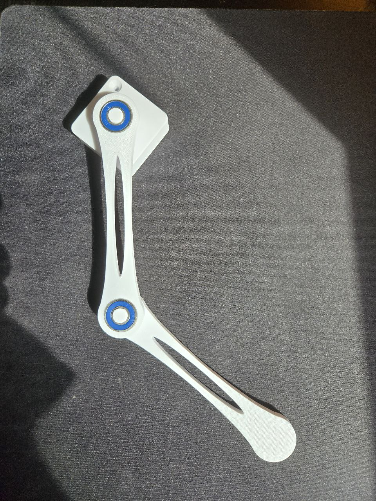
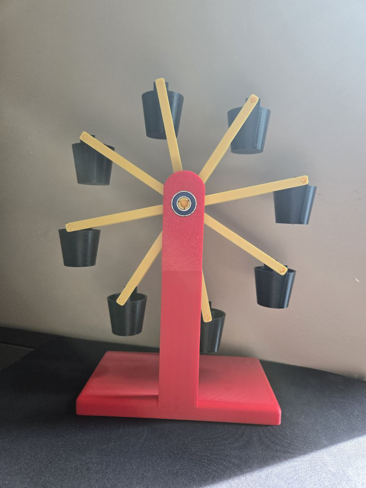

# 3D Printing Chaos: Physical Models of Chaotic Systems

This project explores the intersection of **chaos theory** and **3D printing** through physical models of three well-known chaotic systems:

- 🌪️ **Chaotic Attractors**
- 🪀 **Double Pendulum**
- 💧 **Malkus Waterwheel**

Each model was designed in **Fusion 360** and printed using **PETG** filament. Along the way, I experimented with different techniques and materials (including PVA for supports), documented failures and successes, and ultimately demonstrated these chaotic systems at a public research conference.

---

## 🔬 Project Overview

### 1. Chaotic Attractors
- Attempted to print 3D models of the **Lorenz** and **Rössler** attractors
- Prints failed due to thin, intricate geometry and poor support removal (PETG & PVA)
- Detailed notes and images in [`/attractors`](./attractors)
  
  


### 2. Double Pendulum
- Designed a physical double pendulum using 3D printed parts and **R6-2RS ball bearings**
- Exhibits classic chaotic behavior when released from nearly identical initial positions
- Includes demo video showing four pendulums diverging in motion
- Files and notes in [`/double_pendulum`](./double_pendulum)
  
  


### 3. Malkus Waterwheel
- Built a working Malkus Waterwheel to demonstrate Lorenz-like chaos using water flow
- Features adjustable bucket hole sizes and low-friction design
- Full setup instructions, STL files, and YouTube demo included  
- 📺 [Watch the demo video](https://www.youtube.com/watch?v=cnNCIptOIRE)  
- Details in [`/malkus_waterwheel`](./malkus_waterwheel)
  


---

## 🎓 Conference Presentation

We presented this project at the **Montgomery College STEM Student Research Conference** on **May 19**, 2025. The talk covered the physics of chaos, the design and fabrication process, and lessons learned from failed prints.

👥 Presented by:
- **Anver Ismagilov**  
- **Renata Podlesny**


🖥️ [View our presentation slides on Canva](https://www.canva.com/design/DAGmg528J3k/wflEtCZgoDJZ-1yIyHF0FA/edit?utm_content=DAGmg528J3k&utm_campaign=designshare&utm_medium=link2&utm_source=sharebutton)


---

## 📁 Repository Structure

```plaintext
chaos-theory-3d-printing/
├── attractors/          # Halvorsen attractor attempts + failure notes
├── double_pendulum/     # STL & Fusion files, images, video link
├── malkus_waterwheel/   # Full waterwheel model, setup tips, video link
├── conference/          # Presentation photo from STEM research conference
└── README.md            # You're here!
